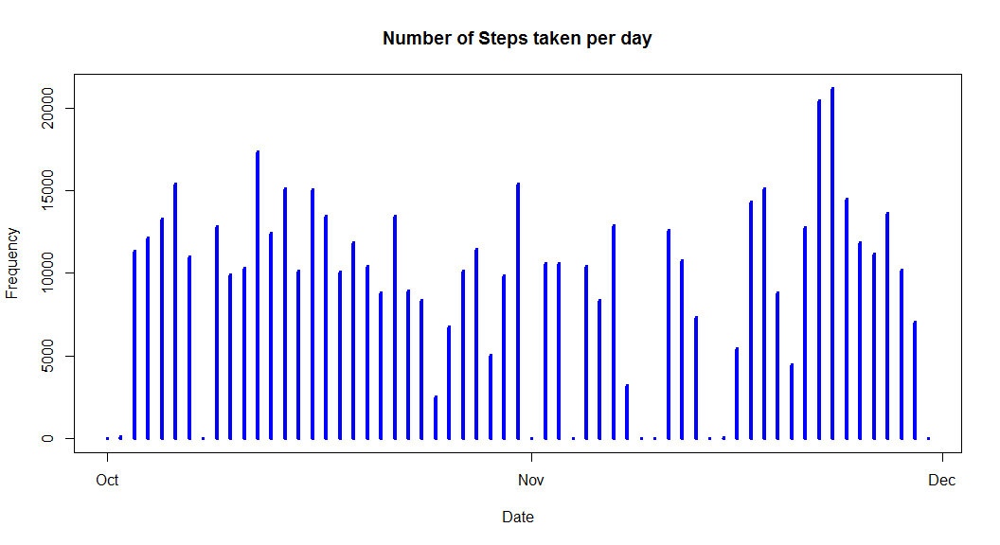
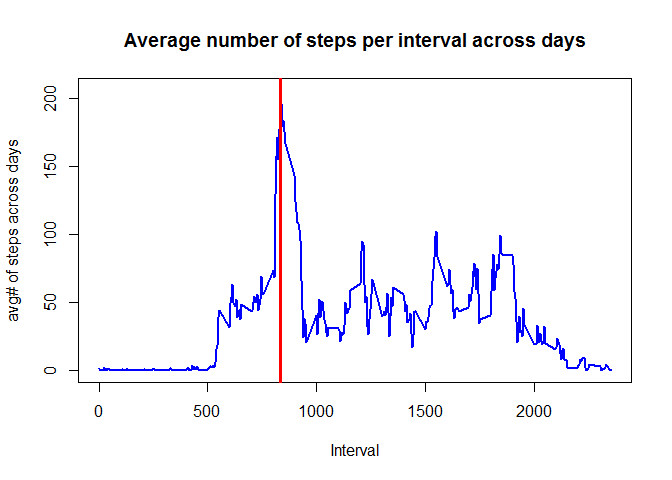
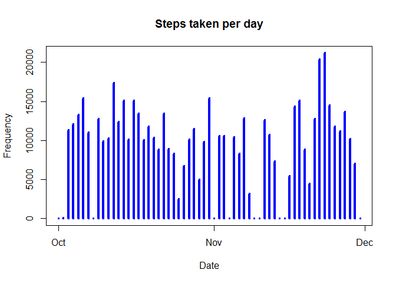
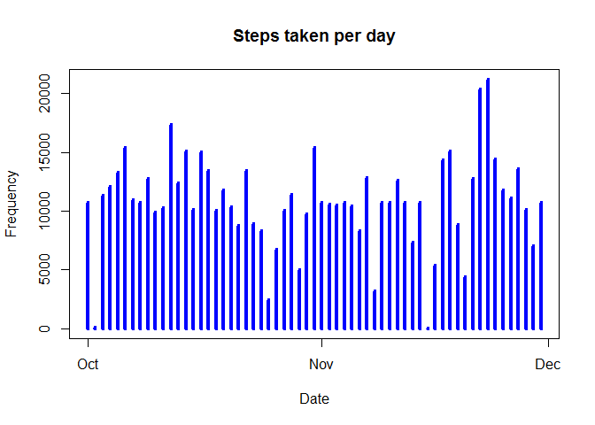

# Reproducible Research: Peer Assessment 1
# Introduction

It is now possible to collect a large amount of data about personal
movement using activity monitoring devices such as a
[Fitbit](http://www.fitbit.com), [Nike
Fuelband](http://www.nike.com/us/en_us/c/nikeplus-fuelband), or
[Jawbone Up](https://jawbone.com/up). These type of devices are part of
the "quantified self" movement -- a group of enthusiasts who take
measurements about themselves regularly to improve their health, to
find patterns in their behavior, or because they are tech geeks. But
these data remain under-utilized both because the raw data are hard to
obtain and there is a lack of statistical methods and software for
processing and interpreting the data.

This assignment makes use of data from a personal activity monitoring
device. This device collects data at 5 minute intervals through out the
day. The data consists of two months of data from an anonymous
individual collected during the months of October and November, 2012
and include the number of steps taken in 5 minute intervals each day.

## Data

* Dataset: [Activity monitoring data](https://d396qusza40orc.cloudfront.net/repdata%2Fdata%2Factivity.zip) [52K]

The variables included in this dataset are:

* **steps**: Number of steps taking in a 5-minute interval (missing
    values are coded as `NA`)

* **date**: The date on which the measurement was taken in YYYY-MM-DD
    format

* **interval**: Identifier for the 5-minute interval in which
    measurement was taken


The dataset is stored in a comma-separated-value (CSV) file and there
are a total of 17,568 observations in this
dataset.

## Analysis Steps
There are five steps in the analysis that is undertaken:

1. Loading and pre-processing data.

2. Plotting histogram of the total number of steps taken each day as well as the mean and median steps per day.

3. The average daily activity pattern, plotted in a time-series plot for each 5 minute interval with the average number of steps averaged across all days.

4. Inputting the missing values, with a simple strategy to replace the missing values with a filler value, that is chosen from the mean within the 5-minute interval the value was missing for.

5. Splitting up the data by weekday and weekend and observing if there is any difference in the activity patterns in both classes.

## Loading and preprocessing the data
The first thing that needs to be done is to unzip the file containing the data and to read the data into R.
The next thing that takes place is the data clean up, in order to have the data presentable for analysis.

```r
library(dplyr)
library(ggplot2)

unzip("activity.zip") #unzip archive
activitydata <- read.csv("activity.csv")  #read data to R
head(activitydata) # display head
```

```
##   steps       date interval
## 1    NA 2012-10-01        0
## 2    NA 2012-10-01        5
## 3    NA 2012-10-01       10
## 4    NA 2012-10-01       15
## 5    NA 2012-10-01       20
## 6    NA 2012-10-01       25
```

```r
# Turn the date into a valid date class
# Dates are in YYYY-MM-DD format
dates <- strptime(activitydata$date, "%Y-%m-%d")
activitydata$date <- dates

#Extrapolate a set of unique days
uniqueDates <- unique(dates)

#extrapolate set of unique intervals
uniqueIntervals <- unique(activitydata$interval)
```
Unique dates and unique intervals would be used primary to help with the plotting of the necessary data.


## What is mean total number of steps taken per day?
First the histogram of the total number of steps taken for each day is plotted. 
In order to do this, we need to split the data into dataframes to represent each particular day. All NA values will be ignored for the time being. In the histogram the x-axis represents the particular day while the y axis represents the total number of steps taken for each day. We will also calculate the mean and median steps per day as well.


```r
# first split the data frame for steps by day
stepsSplit <- split(activitydata$steps, dates$yday)

#find total number of steps over each day
totalStepsPerDay <- sapply(stepsSplit,sum,na.rm=TRUE)

# plot a histogram where the x-axi denotes the day and y-axis denotes the number of steps taken
# per day
plot(uniqueDates, totalStepsPerDay, main="Number of Steps taken per day",xlab="Date", ylab="Frequency", type="h", lwd=4,col="blue")
```

 

```r
# display the median and mean
summary(totalStepsPerDay)
```

```
##    Min. 1st Qu.  Median    Mean 3rd Qu.    Max. 
##       0    6778   10400    9354   12810   21190
```


## What is the average daily activity pattern?
We will focus on the number of steps taken in each specific 5 minute interval. Missing values will be ignored.
The same strategy as before would be used, computing a summary in each interval firsr before plotting the results.
We will plot the data as a time-series plot of type="l". Once the data is plotted, we will locate qwhere in the time-series plot the maximum is located and will draw the vertical line to indicate this location.

```r
# Split up the data according to the interval
intervalSplit <- split(activitydata$steps, activitydata$interval)

# Find the average amount of steps per interval - ignore NA
averageStepsPerInterval <- sapply(intervalSplit, mean, na.rm=TRUE)

# plot the time-series graph
plot(uniqueIntervals, averageStepsPerInterval, type="l", main="Average number of steps per interval across days", xlab="Interval", ylab="avg# of steps across days", lwd=2, col="blue")

# find the location of where the maximum is at
maxIntervalDays <- max(averageStepsPerInterval, na.rm=TRUE)
maxIndex <- as.numeric(which(averageStepsPerInterval == maxIntervalDays))

# plot a vertical line where the max is
maxInterval <- uniqueIntervals[maxIndex]
abline(v=maxInterval,col="red", lwd=3)
```

 

```r
maxInterval
```

```
## [1] 835
```

## Imputing missing values
Lets calculate the total number of missing values there are. This would denote the number of observations that did not have any steps recorded.

```r
# use complete.cases to find the vector that returns true
# if it is a complete row, and false otherwise
completeRowsBool <- complete.cases(activitydata$steps)
numNA <- sum(as.numeric(!completeRowsBool))
numNA
```

```
## [1] 2304
```
#### 1. Calculate the total number of missing values
The strategy that would be used to fill the missing value in the data is the mean of that particular 5-minute interval the observation falls on.

```r
na<-sum(is.na(activitydata))
rate<-paste(round(100*(na/nrow(activitydata)),0),"%") ## percent of missing values
rate
```

```
## [1] "13 %"
```
#### 2. Filling in the missing values using the mean of the 5-minute interval

```r
byInterval <- aggregate(steps ~ interval, data=activitydata, FUN=function(x){
  mean(x, na.rm=TRUE)
})
activitydatanew <- activitydata
for(i in 1:length(activitydatanew$steps)){
  if(is.na(activitydatanew[i,1])){
    ## corresponding 5-min interval, computed before
    steps_average <- subset(byInterval,byInterval$interval == as.numeric(activitydatanew[i,3]))$steps
    ## replace value
    activitydatanew[i,1]<-steps_average
  }
  else{
    activitydatanew[i,1]<-activitydatanew[i,1]
  }
  activitydatanew
}
```
#### 3. NEw dataset with missing values filled.

```r
head(activitydatanew)
```

```
##       steps       date interval
## 1 1.7169811 2012-10-01        0
## 2 0.3396226 2012-10-01        5
## 3 0.1320755 2012-10-01       10
## 4 0.1509434 2012-10-01       15
## 5 0.0754717 2012-10-01       20
## 6 2.0943396 2012-10-01       25
```

```r
tail(activitydatanew)
```

```
##           steps       date interval
## 17563 2.6037736 2012-11-30     2330
## 17564 4.6981132 2012-11-30     2335
## 17565 3.3018868 2012-11-30     2340
## 17566 0.6415094 2012-11-30     2345
## 17567 0.2264151 2012-11-30     2350
## 17568 1.0754717 2012-11-30     2355
```

```r
na<-sum(is.na(activitydatanew))
rate<-paste(round(100*(na/nrow(activitydatanew)),0),"%") ## percentage of NA values
rate
```

```
## [1] "0 %"
```
#### 4. Histogram of the total number of steps taken each day. Impact of the missing value imputing strategy

```r
stepsSplit <- split(activitydatanew$steps, dates$yday)

totalStepsPerDayNew <- sapply(stepsSplit,sum,na.rm=TRUE)
plot(uniqueDates, totalStepsPerDay, main="Steps taken per day",xlab="Date", ylab="Frequency", type="h", lwd=4,col="blue")
```

 

```r
plot(uniqueDates, totalStepsPerDayNew, main="Steps taken per day",xlab="Date", ylab="Frequency", type="h", lwd=4,col="blue")
```

 

```r
summary(totalStepsPerDayNew)
```

```
##    Min. 1st Qu.  Median    Mean 3rd Qu.    Max. 
##      41    9819   10770   10770   12810   21190
```

## Are there differences in activity patterns between weekdays and weekends?
#### 1. Create new factor with two levels - "weekday" and "weekend".
Factor indicates if a given date is a weekday or weekend.

```r
## creates a new column with days of each week
activitydatanew <- mutate(activitydata, day=weekdays(date))

## creates a factor variable with 2 levels
for(i in 1:length(activitydatanew$day)){
  if(activitydatanew[i,4]=="Saturday" || activitydatanew[i,4]=="Sunday"){
    activitydatanew[i,4]<-"weekend"
  }
  else{
    activitydatanew[i,4]<-"weekday"
  }
}

activitydatanew$day <-as.factor(activitydatanew$day)
head(activitydatanew)
```

```
##   steps       date interval     day
## 1    NA 2012-10-01        0 weekday
## 2    NA 2012-10-01        5 weekday
## 3    NA 2012-10-01       10 weekday
## 4    NA 2012-10-01       15 weekday
## 5    NA 2012-10-01       20 weekday
## 6    NA 2012-10-01       25 weekday
```

```r
tail(activitydatanew)
```

```
##       steps       date interval     day
## 17563    NA 2012-11-30     2330 weekday
## 17564    NA 2012-11-30     2335 weekday
## 17565    NA 2012-11-30     2340 weekday
## 17566    NA 2012-11-30     2345 weekday
## 17567    NA 2012-11-30     2350 weekday
## 17568    NA 2012-11-30     2355 weekday
```
### 2. Panel plot containing a time series plot of the 5-min interval and average number of steps taken
Averaged across all weekday or weekend days.

```r
### computes a summary of avg no. of steps taken across all weekday and ends
summary <-aggregate(activitydatanew$steps, list(interval=activitydatanew$interval, day=activitydatanew$day),mean)
names(summary)<- c("interval", "day", "steps")
head(summary)
```

```
##   interval     day steps
## 1        0 weekday    NA
## 2        5 weekday    NA
## 3       10 weekday    NA
## 4       15 weekday    NA
## 5       20 weekday    NA
## 6       25 weekday    NA
```

```r
## plot using ggplot2
## ggplot(summary,aes(interval,steps)) + geom_line(color="blue", lwd=0.5) + facet_wrap(~day, ncol=1) + labs(title=expression("Weekend vs Weekday"))
```
